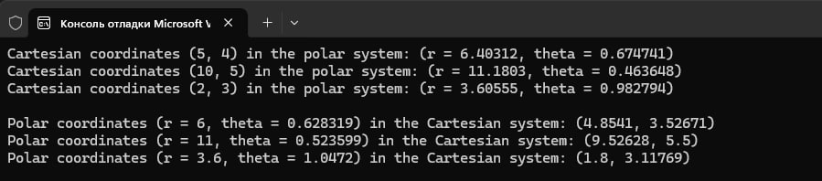
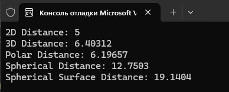
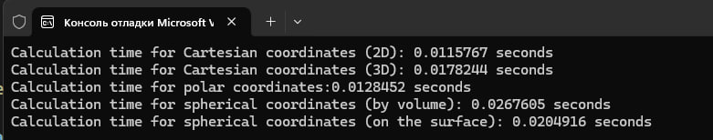
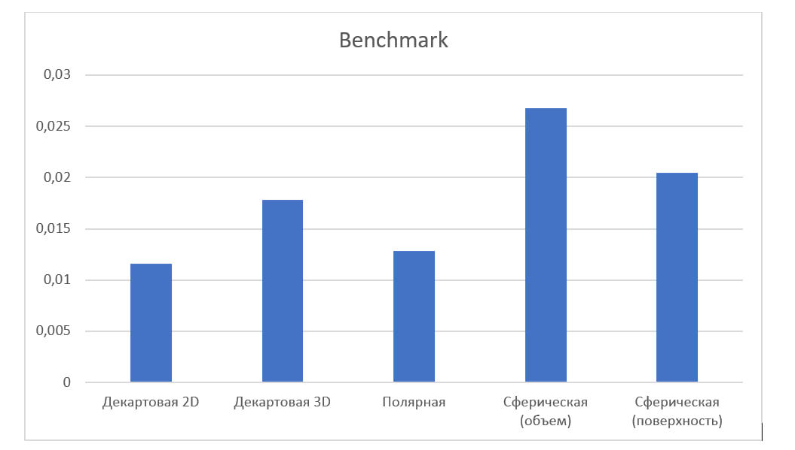

# lab_3
Лабораторна робота №3 "Реалізація перетворень між системами координат"

Для прикладу був створений масив для трьох точок.
 Перше завдання: У main() функції спочатку конвертуються декартові координати (x, y) в полярні (r, θ) і виводяться результати. Потім полярні координати (r, θ) перетворюються назад у декартові (x, y) і також виводяться результати.
 Друге завдання: Спочатку він перетворюються декартові координати трьох точок у сферичні координати та виводиться результат. Потім він перетворює сферичні координати трьох точок у декартові та також виводить результати. Для конвертації використовуються стандартні математичні формули для перетворення між цими системами координат.
 
Після конвертації з полярної системи в декартову та з сферичної системи в декартову, а потім навпаки координати мали деяку похибку, це пов'язано з відсутністью M_PI (числа пі) у математичній бібліотеці С++.

Функції distance2D і distance3D обчислюють евклідову відстань між двома точками в 2D та 3D відповідно. Функція polarDistance визначає відстань між двома точками в полярних координатах, а sphericalDistance обчислює відстань між точками в сферичних координатах. SphericalSurfaceDistance розраховує відстань по поверхні сфери між двома точками на її поверхні. 

Код генерує випадкові точки в декартових, полярних і сферичних координатах, обчислює відстані між точками в кожній системі координат і вимірює час виконання цих обчислень.
На діаграмах можна побачити, ща декартова двовимірна система скоріша за всіх, це зумовлено тим, що для обчислення використовується тільки дві точки та прості розрахунки, на відміну від полярної та сферичної системи, у яких використовуються тригонометричні формули. 
Обчислення були проведені як у двовимірному так й трьохвимірному просторі для декартової системи координат, та за об'ємом та по поверхні сфери для сферичної системи координат.

