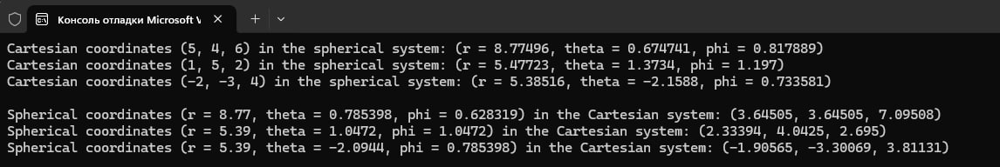

# lab_3
Лабораторна робота №3 "Реалізація перетворень між системами координат"

Для прикладу був створений масив для трьох точок.
 Перше завдання: У main() функції спочатку конвертуються декартові координати (x, y) в полярні (r, θ) і виводяться результати. Потім полярні координати (r, θ) перетворюються назад у декартові (x, y) і також виводяться результати.
 Друге завдання: 
 

Після конвертації з полярної системи в декартову та з сферичної системи в декартову, а потім навпаки координати мали деяку похибку, це пов'язано з відсутністью M_PI (числа пі) у математичній бібліотеці С++.

